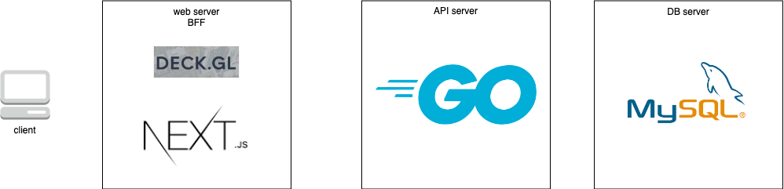
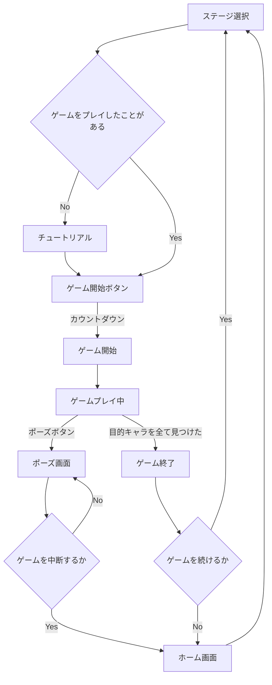
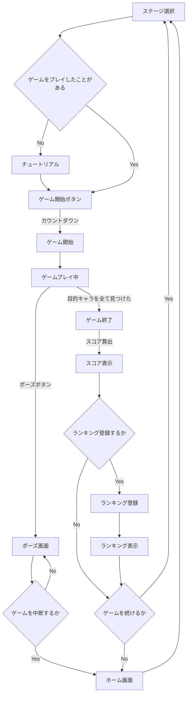
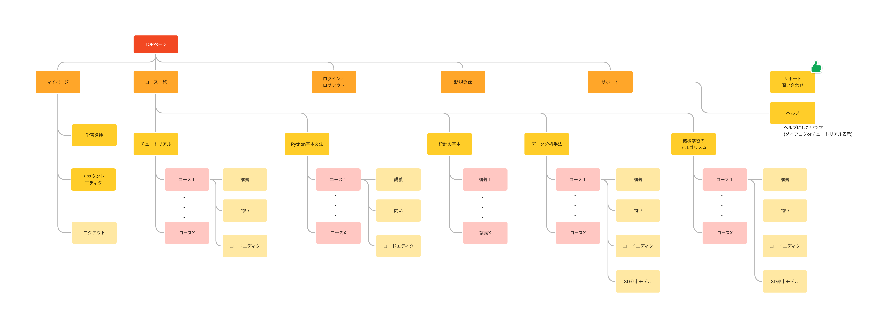

# 設計書

# 概要

本ドキュメントは、3D 都市モデル「Plateau」を使用した人探しゲームの Web サービスの開発についての設計書である。

# システム設計

## コンポーネント構成

本システムは、以下のコンポーネントから構成される。

| コンポーネント名       | 機能                                                                                       |
| ---------------------- | ------------------------------------------------------------------------------------------ |
| web サーバ             | ユーザーからのリクエストを受け取り、静的コンテンツを提供する。                             |
| BFF | Next.jsのapp router
| APIサーバ | ユーザー認証、ユーザーランキングの提供
| データベースサーバ     | 永続化データの保存 |

## システム構成図

## ネットワーク構成

<!-- AWSのアーキテクチャ記載する -->

## 使用する言語・ミドルウェアのバージョン

<!-- 仮おき。技術選定の際に詳細を決める。 -->

|      項目      |           技術            | バージョン | 詳細                                     |
| :------------: | :-----------------------: | :--------: | :--------------------------------------- |
| フロントエンド |         React.js          |   v18.0    | ユーザインターフェースの作成に使用する。 |
| フロントエンド |          Deck.gl          |        | 3D モデルのレンダリングに使用する。      |
|  バックエンド  |          Golang           |       |                                          |
|  データベース  |                           |            | データストレージとして使用する。         |
| 3D 都市モデル  |          Plateau          |            |                                          |
|   コンテナ化   |          Docker           |            |                                          |
|    クラウド    | AWS (Amazon Web Services) |     -      | インフラとして使用する。                 |

# 機能設計

<!-- コンポーネントまたは機能毎に項目を分けて機能設計を行う。 -->
## ゲームプレイ
ゲームプレイ時の一連の流れをアクティビティ図で示す。
### ノーマルモード
- ノーマルモードではAPIリクエストは発生しない。

<!-- 未プレイ時にはチュートリアル入れる -->

### タイムアタックモード
- ランキング登録、表示時にAPIリクエストが発生する。

# 画面設計

## サイトマップ
<!-- 
[figma URL](https://www.figma.com/file/VJiOiy9VSHJai0a73iUv56/%E3%82%B5%E3%82%A4%E3%83%88%E3%83%9E%E3%83%83%E3%83%97?type=whiteboard&node-id=0-1&t=t6i4SRKVEOY0TC9F-0)

 -->

## ワイヤーフレーム

<!-- [figma URL](https://www.figma.com/file/UkDpYPAXCMK2xBxcXA1Hkf/%E3%83%AF%E3%82%A4%E3%83%A4%E3%83%BC%E3%83%95%E3%83%AC%E3%83%BC%E3%83%A0?type=design&node-id=13-140&mode=design&t=t6i4SRKVEOY0TC9F-0) -->

<!-- システム概要を示す図(figma)が1枚以上あると、発表のときにも使えると思います -->

## UIデザイン

<!-- 各画面のデザインを作成したら, こちらにfigmaのURLを記載してください-->

# データ設計

## 論理設計

<!-- RDBかNoSQLか未定ですが, データモデリングについて記載します -->
<!-- 必要であれば, テーブル定義書やER図とかも書きます -->
