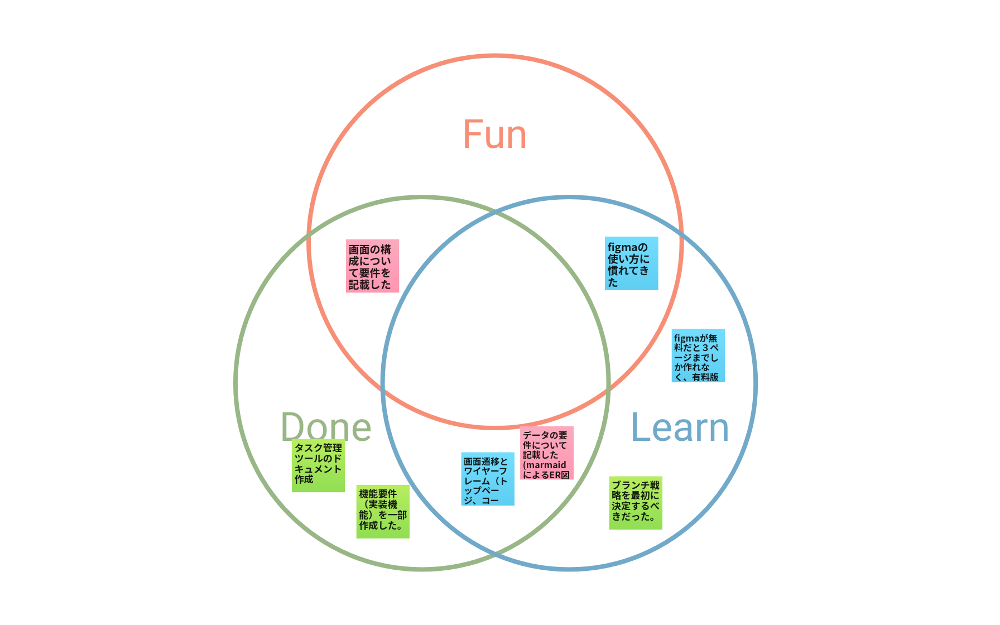

# 2023/07/17 MTG

## 目標

- 進捗確認
- タスク管理とブランチ戦略の方針決定

## 出席者

- [@yziori](https://github.com/yziori)
- [@niwakumo](https://github.com/niwakumo)
- [@ansony1242](https://github.com/ansony1242)

## やったこと・きまったこと

- タスク管理方法を決めていなかった。
  - github Projects を使用して、カンバン方式のタスク管理を行う。
- ブランチが一つだけなので main の取り合いになっている。また、ドキュメント作成時にレビュワーが決まっていないのも課題。
  - ブランチ戦略を決めることで解決を図る。[gitflow](https://www.atlassian.com/ja/git/tutorials/comparing-workflows/gitflow-workflow)に準拠する。
    - develop branch は draft branch とする。(document 専用のため)
    - issue から feature branch を作成、タスクが完了したら draft branch にマージする。Sprint 完了時または、まとまったものが完成次第 main branch にマージする。
- figma のページが無料版だと 3 ページしか使用できない。
  - 1 ページに複数の画面を作成できるので、それで対応する。

### 進捗

#### 振り返り(Fun Done Learn)

#### [@yziori](https://github.com/yziori)

- タスク管理ツールのドキュメントを一部作成
- 要件定義の実装機能を追記
- issue のテンプレ作成

#### [@niwakumo](https://github.com/niwakumo)

- 画面要件作成
- データ要件作成(ER 図)

#### [@ansony1242](https://github.com/ansony1242)

- サイトマップ作成
- ワイヤーフレーム作成
  - トップページ
  - 学習進捗ページ
  - 学習コンテンツページ

### 宿題

#### [@yziori](https://github.com/yziori)

- 基本設計の雛形作成
- タスク管理ツールドキュメント作成
- ブランチ戦略を整える。
  - ドキュメント作成
  - issue・pull reqs テンプレ作成
  - github 設定変更
- 画面デザイン

#### [@niwakumo](https://github.com/niwakumo)

- データ要件作成
- 基本設計

#### [@ansony1242](https://github.com/ansony1242)

- のこりの画面のワイヤーフレーム作成
- readme に figma の URL 貼る

### 次回 MTG

未定
