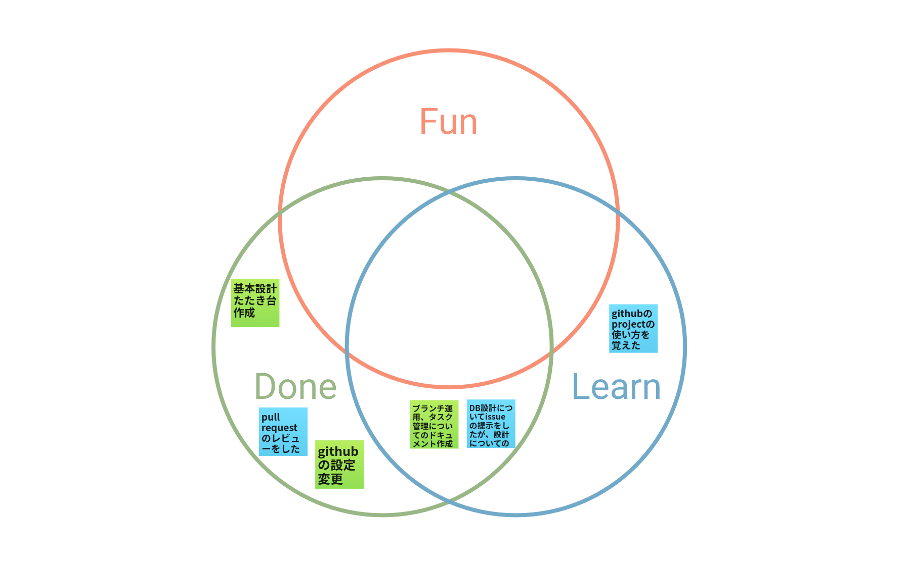

# 2023/07/30 MTG

## 目標

- 進捗確認
- #3 Sprint のタスク振り

## 出席者

- [@yziori](https://github.com/yziori)
- [@niwakumo](https://github.com/niwakumo)

## やったこと・きまったこと

- プロトタイピングで進めていく。

  - 設計書作成は保留。実装は要件定義書をベースとして進める。
  - 各々できそうなタスク見つけて issue 切って進める。

- 技術選定
  - フロントエンド：Next.js(TS), ESLint, jest
  - デプロイ：vercel
    - 開発速度重視でとりあえず vercel にデプロイする。
    - 今後バックエンド開発に取り掛かった際に AWS 等のインフラを
  - 3Dmodel レンダリング：deck.gl
  - 埋め込みエディタ：未定

### 進捗

#### 振り返り(Fun Done Learn)

#### [@yziori](https://github.com/yziori)

- 基本設計書たたき台作成
- github の設定変更
  - プルリク
  - メンバー権限
- ブランチ運用、タスク管理用のドキュメント作成

#### [@niwakumo](https://github.com/niwakumo)

- プルリクレビュー
- db 設計について issue 作成
  - 上記方針のため一旦保留。

### 宿題

#### [@yziori](https://github.com/yziori)

- フロントエンド環境構築
- デザイン作成

#### [@niwakumo](https://github.com/niwakumo)

- エディタ選定
  - チュートリアルまで目標。

### 次回 MTG

未定
