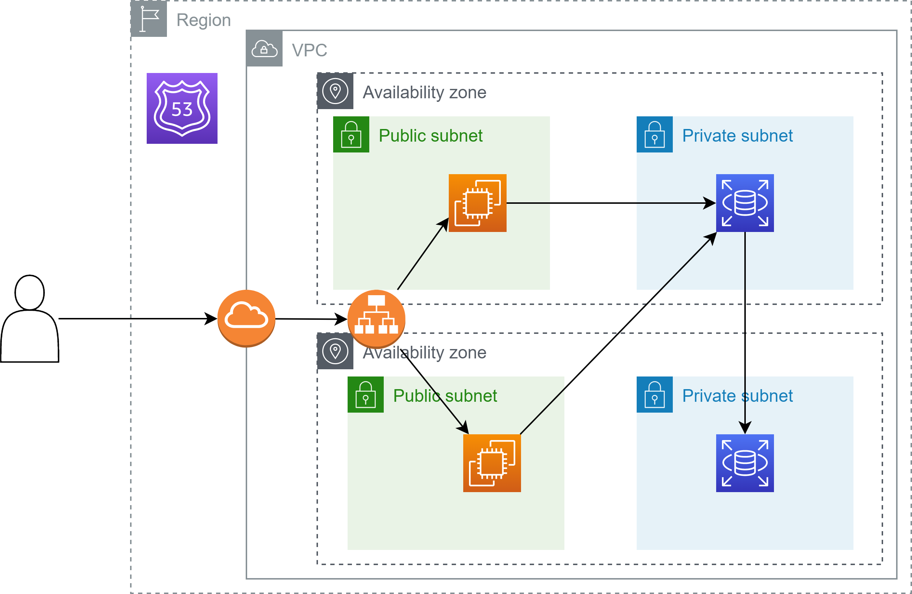
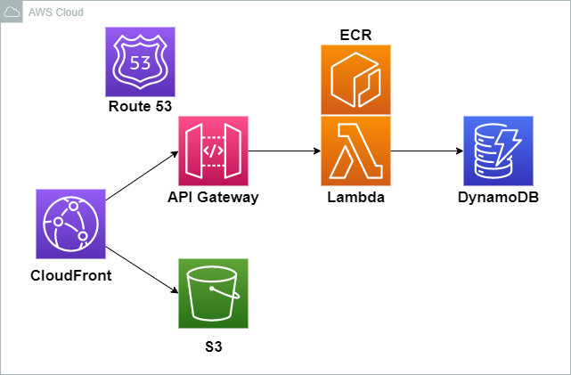
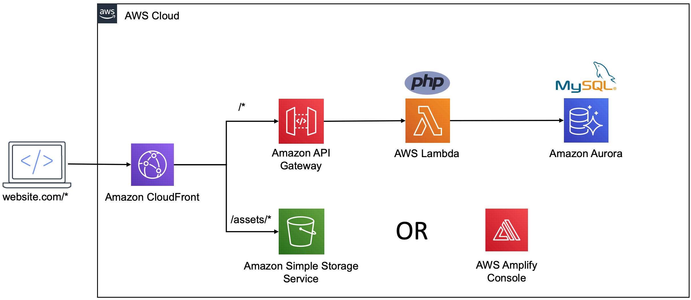
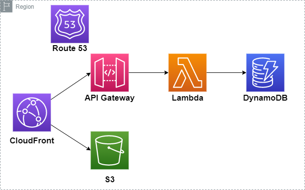
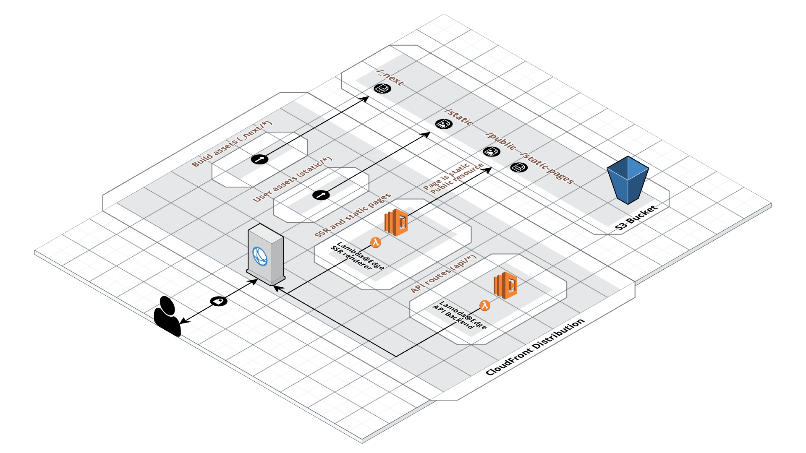

# サーバー構成検討

## 理想だったAWS構成

EC2やRDSは起動しているだけでそれなりの料金がかかる（従量課金を考慮しない金額）

- EC2　1,085円 ※t2.micro（1cpu 1GiB）
- RDS　2,340円 ※db.t4g.micro

金額を抑えるためにサーバーレスサービスを中心に検討する

## サーバーレスサービスを利用する（AWS）

### 基本構成

使用するサービスはだいたいこんな感じになりそう

### LAMP構成

LAMP環境を構築しようとするとこんな感じ

### CSR

CSRやるならこんな感じ

### SSR

SSRやるならこんな感じ

Building server-side rendering for React in AWS Lambda
  https://aws.amazon.com/jp/blogs/compute/building-server-side-rendering-for-react-in-aws-lambda/

### Nextjsフレームワーク

Nextjsは非公式のフレームワークがあるみたい

Serverless Nextjs Plugin
  https://www.serverless.com/plugins/serverless-nextjs-plugin

## AWS Amplifyを利用する

バックエンドを簡単に構築できるサービス（使用するサービスを意識しない）という認識

- 以下引用

Amplify は、1. サーバーレスなバックエンドをセットアップするための Amplify CLI、2.フロントエンドで利用できる UI コンポーネント、3.クライアントサイドから AWS のバックエンドに接続する際に直感的な IF を提供する Amplify Library、4.CI/CD やホスティングのためのコンソール、を含む Web およびモバイルアプリ開発のためのフレームワークです。

https://whnyab.com/amplify-ssr-cicd/

## GCPを利用する

### Firebase

AWS AmplifyのGCP版

以下の機能から必要な機能を選択して使用する感じ  
料金は従量課金制でぱっと見た感じAWSと大差なさそう

- Hosting  
  フロントエンドのインターネット公開
- Storage  
  ファイルのアップロード先（AWSのS3）
- Cloud Firestore  
  NoSQLのDB
- Cloud Functions  
  バックエンドプログラムの実行（AWSのLambda）
- Authentication  
  認証機能

 

少し使用してみたがサービスの選択は直観的で分かりやすい  
（静的コンテンツとかはHostingで爆速で公開できる  
Amplifyがよく分からなかったから感動した）  
主にWebサイトから操作したからCLIはあまり使用していない  

## 参考URL
